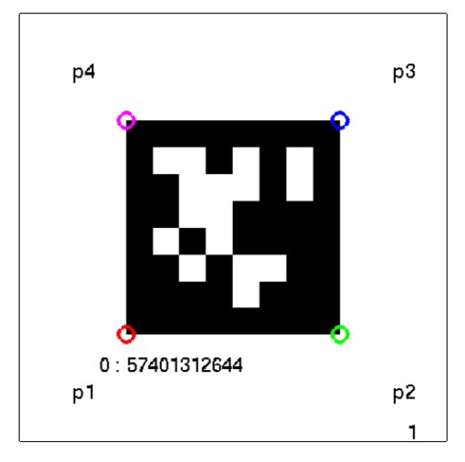
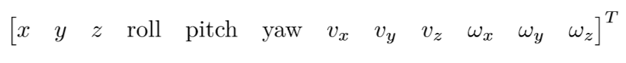
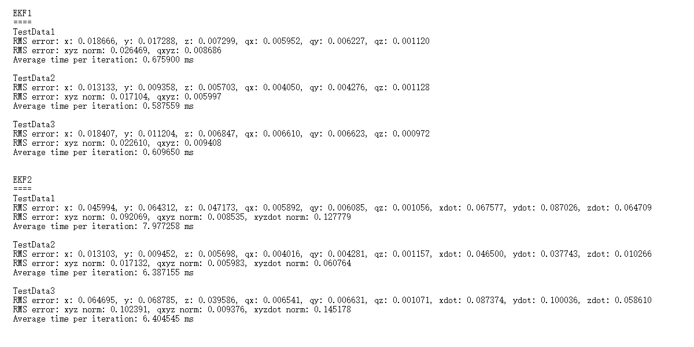

# EKF based Visual-Inertial-Odometry
This package implements the Visual Inertial Odometry to estimate the states of a Quadrotor, including its global position [x, y, z], pose [roll, pitch, yaw] and linear velocity with respected to the world [vx, vy, vz]. 

Experiment Environment
----------------------
All practical experiments and data collections are completed in an indoor environment (GRASP Lab), moreover, in order to detect good features, we use _April Tags Map_ on the floor to help the estimation.       

Below shows the map, since we know the size of each Tag and the arranged position, such that we can obtain the 3D position of each corner.

  

In addition, for each AprilTag, we define its four corner order as below, which can also help to pre-process data for the vision-based update step.

  

Data
----
All data are collected via a Quadrotor onboard sensor, including time, body frame linear acceleration and velocity, captured images. The format of the sensor data struct is as follows:
  1. Time stamp (**t**) in seconds.
  2. The ID of every AprilTag that is observed in the image (**id**).
  3. All detected corners and Tags' center positions in the image frame (**p0**, **p1**, **p2**, **p3**, **p4**).
  4. Rectified image (**img**).
  5. IMU data with Euler angles (**rpy**), body frame angular velocity (**omg**) and linear acceelration (**acc**).

The data file also contains the **Vicon** data taken at 100Hz, which serve as the ground truth measurements, its format is:

  

Note that for some packets no tags or valid features are observed, such that we cannot implement the vision-based estimation for update. However, as the IMU runs at a faster rate than the camera, the EKF will allow us to have somewhat accurate state estimates in these situations.

Algorithms
----------
The algorithm mainly refers to the _Extended Kalman Filter (EKF)_:
* **Motion Model**         
  In the motion model step, we use the observed data (e.g. body frame acceleration or angular velocity from the onboard IMU) to predict the state of a Quadrotor, and the covariance of its distribution. As we know, EKF linearize the model as well as the distribution of states, here we use Gaussian distribution to approximate all states and the noise.

* **Measurement Model**        
  In the measurement step, we use the detected visual features (e.g. April Tags) to update states and covariance. More specifically, 
  * For the Quadrotor _pose estimation_ (x, y, z, roll, pitch, yaw), we implement the Homography estimation and decomposition or linear PnP.
  * For the Quadrotor _velocity estimation_ (vx, vy, vz), we use the optical flow, KLT feature tracker and Motion Field Equations. 

Below links contain more detailed algorithms and analyses:
* [PnP: Perspective N Points Problem](https://onenote.com/webapp/pages?token=ycmkck1e3miTElCSfT2VbGhg1Lex657vyOyfmNlD701EE3ZQD2q-SKtFbFng8lOOwTa_m5tngHlxJxtAhFwWU38iB72I_ZhS0&id=636596632608497895)
* [Optical Flow and Feature Tracking](https://onenote.com/webapp/pages?token=YnZ7hXiscuXMCq0VGxz6TBve3PEiWR-p7TdquG_a50f7Fc13RVJyNm3OF3Ju9BqonDx-cBgIlHoh40JJgTbnmdwRsUM-AkA70&id=636596633282572791)
* [Vision-based Velocity Estimation](https://onenote.com/webapp/pages?token=N0PGRP6E_z3u43enbeXuKXOOPH4arlqz-FvChRHStU6B74jt0R1IlyJUJEte9LZsb-Www7XzOupSRHTNLcKqjspZn3EJ08AX0&id=636596633659952379)
* [Extend Kalman Filter](https://onenote.com/webapp/pages?token=Jcdx-FaWIbaxtKcLiOtszNan6p9cjoPxCgq-OE33hrwNysNS3FQjVMtwXzpeTpGtyu0-C0dL0QObLckTvuMaH-Rbit5ijGYH0&id=636596634171384977)
* [Comparison between EKF, UKF and PF](https://onenote.com/webapp/pages?token=2W6JQWqSyvIaHGd96X4oW9TEd_GEcQkspMNWYjw5a_FyzIv0JEzj3R2Cs4UDzJLp600UnUWDPjWp8AhGB-51nLn6HKKDQ2fO0&id=636596634616564245)

Execution
---------
All source code are stored in the folder **src**. Include all necessary directories, and
* **local_test.m** executes the **ekf1.m** which only estimates the pose (x, y, z, vx, vy, vz) of a Quadrotor.
* **local_test_2.m** executes the **ekf2.m** which includes the estimation of the linear velocity, such that its return is a vector contains all state information (x, y, z, vx, vy, vz, vx, vy, vz) at each time stamp.

Also, you are supposed to see the processing estimation errors in the engine as well as several plots once completing the estimation.

Results
-------
All experiment results are stored in the folder **res**, below show several test results compared with Vicon data.    

  
  
  

Below table shows the overall estimation errors.

  

