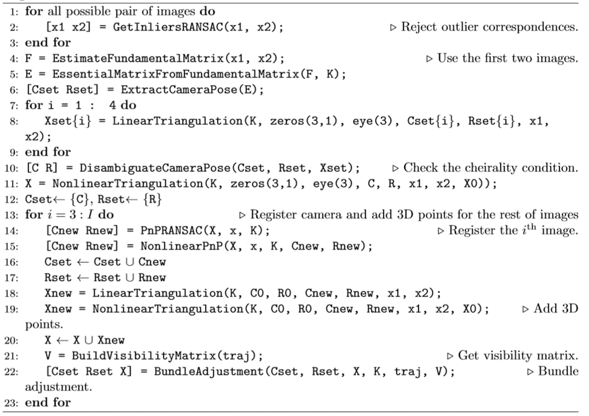
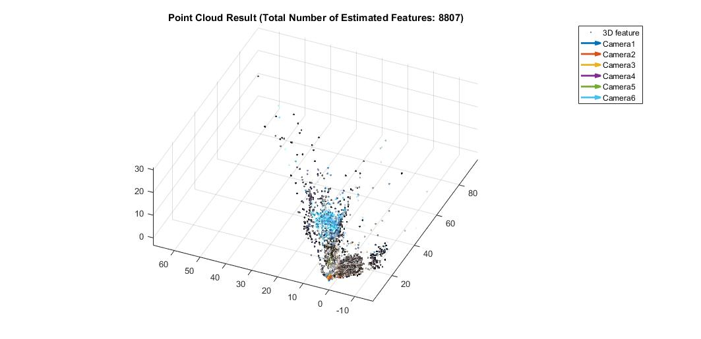
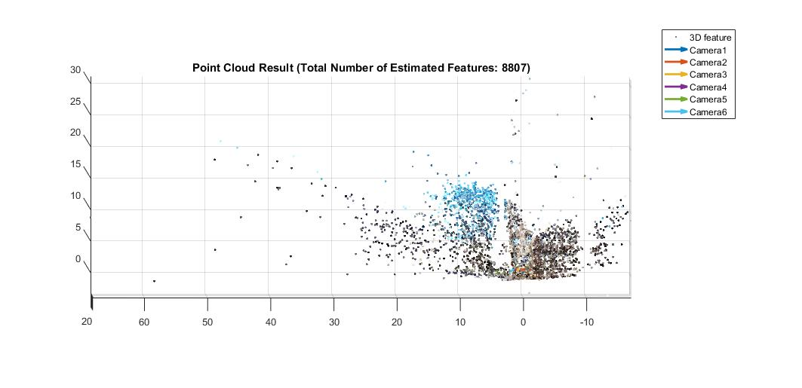
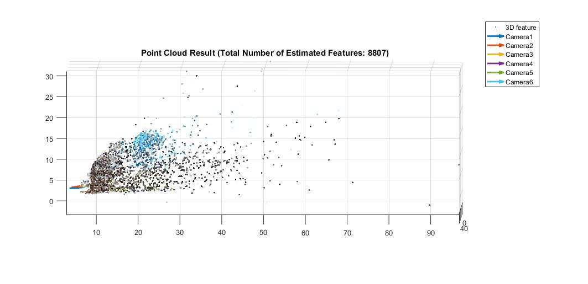
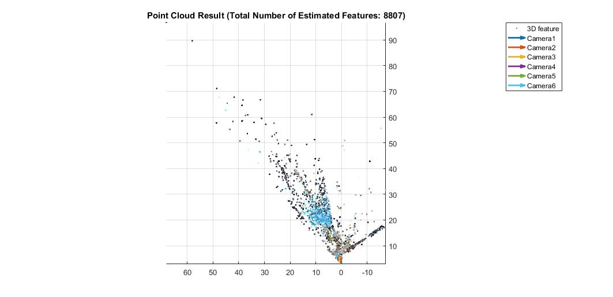
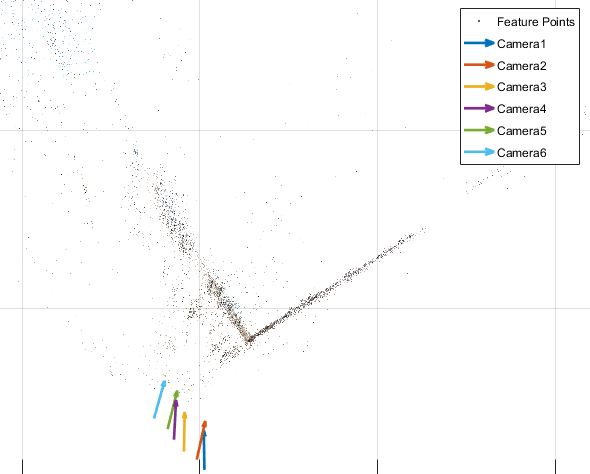

# Structure From Motion (3D Structure Reconstruction)
The package mainly implemented the **_Epipolar Geometry_** algorithm, including the fundamental and essential matrices estimation in order to find the relative pose configuration, linear and nonlinear Triangulation, PnP.      

Finally, using Bundle Adjustment and completed the **_Structure From Motion_** pipeline such that can reconstruct a 3D environment.

Introduction
------------
The _Structure From Motion(SFM)_ is popular used in most Visual SLAM and AR algorithm. The basic idea is, given a series of camera frames and using corresponding features (e.g. SIFT, ORB, BRIEF), we can reconstruct a real 3D environment as well as estimate the pose/trajectory of those cameras.       

Typically, SFM is a nonlinear optimization problem, trying to minimize the **_reprojection error_** from 3D point cloud and corresponding 2D features. In addition, its vision pipeline is also be popular used in the update/measurement step of the modern Vision Odometry/Vision Inertial Odometry algorithm.

Data
----
All data for 3D reconstruction are stored in the folder **_data_**, including:
* _Images_: a series of images captured by the camera and can guarantee each of them have some common regions.
* _matching txt file_: contains correspondeces information for each image frame.

Also, feel free to detect your own features if those are not enough or optimal to you.

Algorithms
----------
The pipeline is straightforward, below shows the pipeline.

  

   

More specifically:
1. Apply **_RANSAC_** to filter out outliers for better geometry estimation.
2. Set the first camera frame as the global origin such that all following ones are estimated respected to the first camera.
3. Based on filtered inliers, use **_first two frames_** combined with _Fundamental_, _Essential matrix_ and _Triangulation_ to **_initialize_** the 3D point cloud as well as the second camera state.
4. For each coming camera frame, use existed 3D point cloud and _PnP_ to estimate its state, then use Triangulation to expand the 3D point cloud, finally, use _Bundle Adjustement_ to refine all existed 3D points and camera(in order to make the algorithm efficient and optimal, the local Bundle Adjustment is recommended).

Feel free to check the detailed algorithm via this paper: [Joint Detection, Tracking and Mapping by Semantic Bundle Adjustment](http://ieeexplore.ieee.org/document/6619046/).

Execution
---------
All source codes are stored in the folder **_src_**. It includes two parts code set:
* One part completes feature matching, cleaning and updating for optimization problem;
* The other part implements visual optimization problems such as linear and nonlinear triangulaion, PnP and bundle adjustment. For nonlinear problem, in addition, you can find all Jacobian matrix implementation to improve the speed and accuracy of algorithm.      

**_Note:_** The function of each file can refer to its name, for instance, the file **_GetInliersRANSAC.m_** is to filter out outliers and keep inliers using RANSAC. And the **_demo.m_** is a fused file which can help check the whole pipeline and training process.

Results
-------
Two folders to store results:
* **_feature_match_res_:** stores the results of feafure detection and matching, as well as fundamental matrix estimation.
* **_3D_map_res_** stores the 3D point cloud map reconstruction as well as the camera trajectory with poses. 

Below show 6 frames of the captured images:

  
  
  
  
  
  

Here post the reconstructed 3D point cloud (from multiple views) and estimated camera trajectory.
* **_3D Perspective View_**
  

    
  
   

* **_Left Side View_**
  

    
  
   

* **_Right Side View_**
  

    
  
   

* **_Top View_**
  

    
  
  

* **_Camera Trajectory_**
  

    
  
   
  

Report
------
For more detailed algorithm explanation and results analyses, feel free to check the **_Report.pdf_**.
