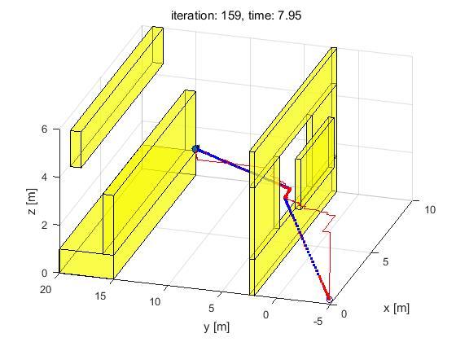
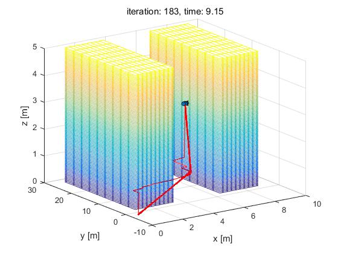

# Trajectory Generation for Quad rotor
The package is amied to design and generate an optimal polynomial smooth trajectory for the Quad rotor.

Polynomial Trajectory Design
----------------------------
Given a map environment (3D) with boundary information, start/goal positions and possible block position, our goal is to design a smooth polynomial trajectory without any collision.      
Here, we implement the __Dijkstra algorithm__ and __A-star__ to search for an optimal path from the start to the goal. Then according to some flag waypoints and velocity, acceleration constraints, we use __Convex optimization__ tools to design a polynomail smooth trajectory.

Trajectory Optimize
---------------------
Given a map and planned path above (either using Dijkstra or A-star), perform some optional smoothing and post processing on the path.      
There are many ways to post process the output of A* / Dijkstra's to reduce the trajectory time. One easy way is to replace segments between points with no obstacles in between them with a straight line (the collide function will be handy here). A spline over the actual path would then help to smooth it out. Finally, the speed along the path can be varied, since it's safe to go faster along long, straight trajectories, but less so when there are many turns.
 
There's a lot of freedom here, so you can try out things to see what works and what doesn't. 

Trajectory Generation and Controller
----------------------
In the real Quad rotor, we use the __PID controller__ to control the flight vehicle given the designed trajectory. For the controller, we use either the __Back-Stepping assumption__ for linear control or __Geometric Nonlinear__ controller. 

Execution
---------
All code files store in the folder **_src_**, feel free to execute the simulator **_runsim.m_** such that you are supposed to see the trajectory generation process. Below give clarifications for part of code files:        

1. _controller_: contains controller algorithm to achieve PID control, using either linear or nonlinear control.
2. _pathPlanning_: contains Dijkstra's algorithm and A-star to plan trajectory.
3. _utils_: contains all helper functions.
4. _trajectory_generator.m_: contains the algorithm to combine controller and trajectory planning.

Results
-------
Below figures show two trajectory planning results in different map environments.         
- _Thin red curve_: planned trajectory obtained from A-star.
- _Thick red dashed curve_: optimized trajectory.

**_Traj Map1_**

  

     

**_Traj Map2_**

  

   
