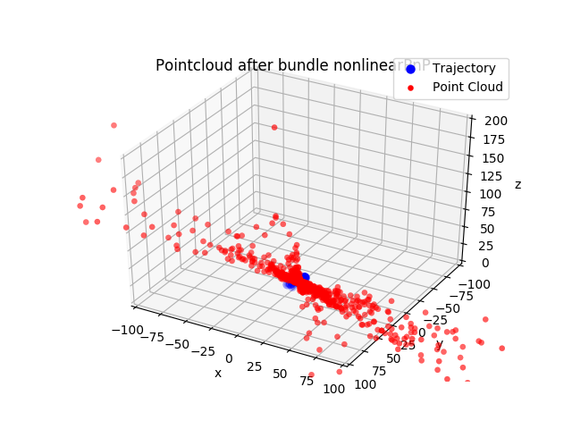
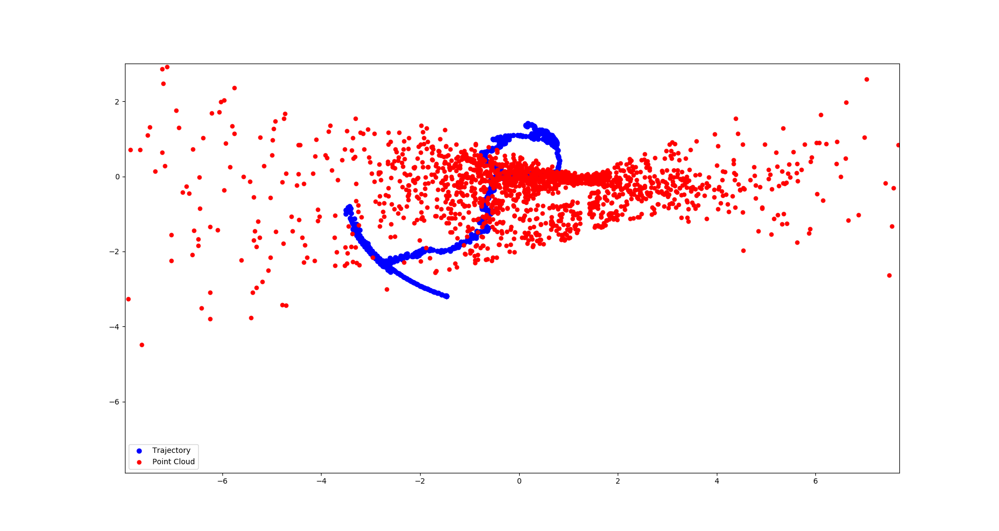

# Visual SLAM using Monocular Camera (Particle Filter Based)

Introduction
------------
We implement this visual SLAM based on the common SLAM using _Particle Filter_ and a lidar sensor data for update. Here, instead of using scan information from lidar data, we choose visual information to update the pose of camera as well as the 3D point cloud with respect to the global frame.       

Eventually, we expect to build a 3D map with correct estimated trajectory of robot and 3D point cloud respected to the physical world.

Data
----
All data are collected using a real ground robot in an indoor lab environment. The folder **_data_** stores all collected images, however, due to the size capacity, I didn't upload other collected data such as Odometry, IMU. If you are interested in them, feel free to e-mail me via **_[haoyuanz0827 at gmail doc com]_**. 

Algorithms
----------
The package is a fused work based on my previous projects, the corresponding repositories or packages are below:
* **_Machine_Learning_in_Robotics_**            
  The package provides the Particle-Filter based SLAM structure and Kalman Filter implementation to clean up the collected data.

* **_Visual_SLAM/cameraCalibration_**            
  The package supports the good camera calibration algorithm.
  
* **_Visual_SLAM/Structure_From_Motion_**                 
  The package mainly provides the well-work vision-based methods for particle states update, including linear/nonlinear Triangulation, PnP and Bundle Adjustment to optimize the robot and point cloud states.

The main pipeline refers to the _2D SLAM_ algorithm and the paper, [A Multi-State Constraint Kalman Filter
for Vision-aided Inertial Navigation](https://pdfs.semanticscholar.org/2e79/75fb0351638bd2646a217e5885ae56ca5cff.pdf). However, we have modified a little bit in below aspects:

1. **_Particle Filter instead of EKF_**               
  Unlike the reference paper using the EKF structure, here we use the **_Particle Filter_** to estimate the robot state distribution. Since the most real robotic problems are nonlinear and non-Gaussian distribution, such that using particle filter can improve the estimation accuracy.             

2. **_Vision-based Measurement Step_**                
  In the measurement step, we use several visual methods instead of laser scan map to update weights of particles. The main algorithms refer to the _Structure from Motion_ pipeline, such as Triangulation, PnP and Bundle Adjustment to optimize the robot and 3D point cloud space. In addition, the weight for each particle is proportion to the _geometric reprojection error_.      
  
3. **_G2O Implementation_**             
  Thanks to the sparse structure between 3D point cloud and keyframes, finally we use the 3rd-party library **g2O** to achieve an efficient and fast graph optimization in the measurement step to refine the state estimation.
  

Execution
---------
All source codes are stored in the folder **_src_**, and it separates into two sections:
* **_feature_initial_**                         
  The folder contains codes that achieve the motion model in SLAM pipeline, also includes the feature detection, macthing and tracking. Below show corresponding three demo codes:
    * _demo_prediction.py_: implement prediction/motion model of the robot. It will generate four data files after execution.
    * _demo_orb_feature_match.py_: implement the feature detection and matching. Besides, the file also contains 'RANSAC', 'Color Contrast' and some helper functions.
    * _demo_tracking.py_: implement the KLT feature tracking algorithm. Once execute the demo, you are supposed to see a video on the screen showing the tracking process. 

* **_visual_update_**                         
  The folder mainly contains codes that achieve the vision-based update step in SLAM pipeline, including the linear/nonlinear triangulation, linear/nonlinear PnP and bindle adjustment. 
    * _demo_visual_update.py_: fused all work and achieved whole structure. Each time a figure pops up to indicate a completed step. Close it to proceed. 
    

Results and Report
------------------
All results are stored in the folder **_final_results_**, which contains the final results of estimated trajectory and 3D point cloud. For detailed algorithm and results analyses, feel free to check the file **_Report.pdf_**.      

Below show a simple feature matching result and several generated maps.

* **_Feature Matching Performance_**
  

    
  
   

* **_3D Map (Perspective View)_**
  

    
  
   

* **_3D Map (Top View)_**
  

    
  
   
